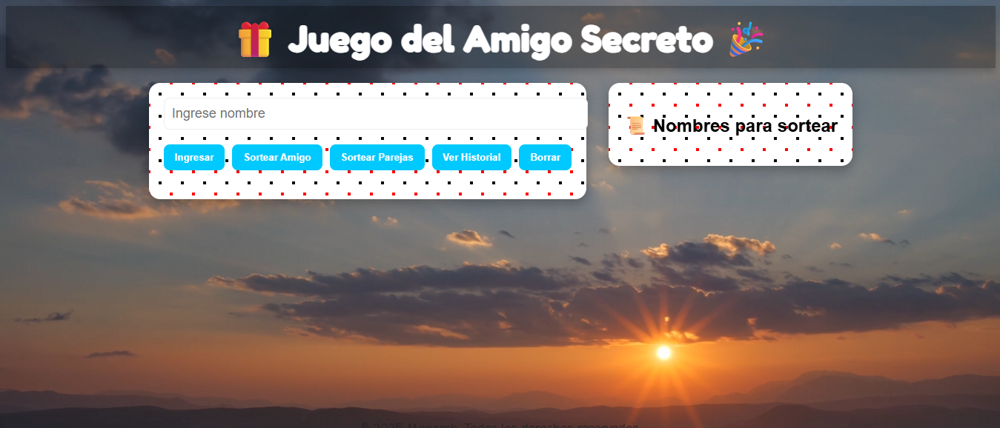
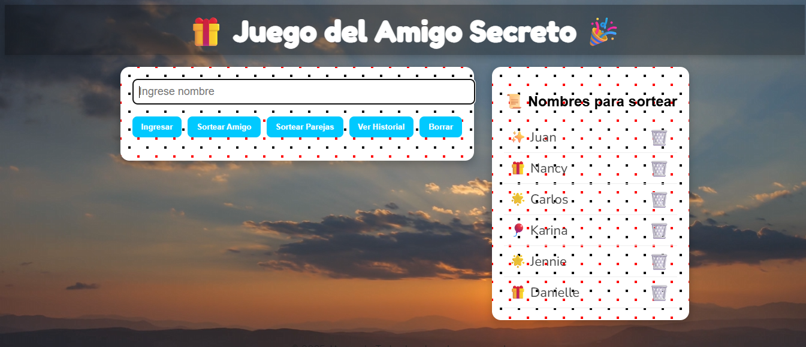
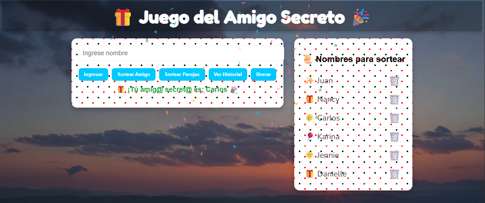
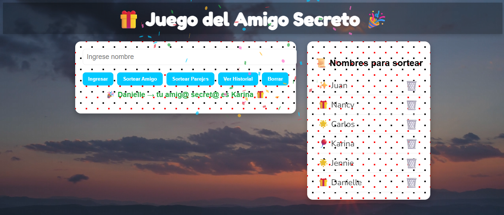
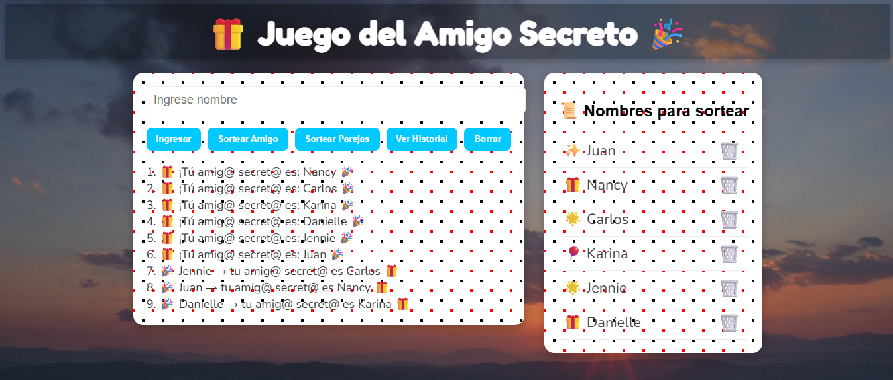

# 🎁 Juego del Amigo Secreto ONE G9

¡Bienvenido al **Juego del Amigo Secreto**! Este proyecto es una aplicación web interactiva para organizar sorteos de amigos secretos de manera divertida y visual. Permite ingresar nombres, sortear amigos o parejas, ver un historial de sorteos y disfrutar de animaciones con confeti.

---

## 📝 Características

- Ingreso de nombres para sorteo.
- Sorteo individual de un amigo secreto.
- Sorteo de parejas aleatorias.
- Visualización de historial de sorteos.
- Botón para reiniciar la lista de nombres y el historial.
- Animaciones de aparición y rebote para los elementos.
- Confeti animado al mostrar el nombre sorteado.
- Lista de nombres con emojis aleatorios y botones de eliminación.
- Fondo divertido con video y diseño colorido.

---

## ⚙️ Tecnologías utilizadas

- **HTML5**: Estructura del proyecto.
- **CSS3**: Estilos, animaciones y diseño responsivo.
- **JavaScript**: Funcionalidad principal del juego, manejo de nombres, sorteos y confeti.
- **Canvas Confetti**: Librería externa para animaciones de confeti.
- **Google Fonts**: Tipografías divertidas (`Fredoka One`, `Baloo 2`, `Nunito`, `Comic Neue`).

---

## 🖥️ Cómo usar

1. Clona el repositorio:

```bash
git clone https://github.com/tuusuario/amigo-secreto.git
````

2. Abre `index.html` en tu navegador web.

3. Ingresa los nombres de los participantes en el campo de texto.

4. Usa los botones para:

   * **Ingresar**: añadir un nombre a la lista.
   * **Sortear Amigo**: seleccionar un amigo secreto al azar.
   * **Sortear Parejas**: formar parejas aleatorias.
   * **Ver Historial**: mostrar los resultados anteriores del sorteo.
   * **Borrar**: limpiar la lista y el historial.

5. Observa las animaciones y disfruta del confeti 🎉 cada vez que se muestre un nombre.

---

## 📂 Estructura del proyecto

```
amigo-secreto/
│
├─ index.html         # Página principal
├─ styles.css         # Estilos y animaciones
├─ scriptv.js         # Funcionalidad principal (JS)
└─ assets/            # Carpeta con video y otros recursos
```

---

## 🎨 Personalización

* Cambia el **video de fondo** reemplazando `tu-video.mp4` en la carpeta `assets`.
* Ajusta la **paleta de colores** en `:root` dentro de `styles.css`.
* Modifica las **fuentes** cambiando las importaciones de Google Fonts y las variables CSS.

---

## 📌 Notas

* Compatible con navegadores modernos (Chrome, Firefox, Edge, Safari).
* Funciona completamente **sin conexión a internet**, excepto para la librería de confeti si se usa CDN.
* Ideal para fiestas, oficinas o grupos de amigos que quieran hacer sorteos virtuales divertidos.

---

## ✨ Capturas de pantalla








---

## 🔗 Licencia

Este proyecto es de **uso libre y educativo**. Puedes modificarlo y compartirlo sin restricciones.

---

¡Diviértete organizando tu Amigo Secreto! 🎁

```
